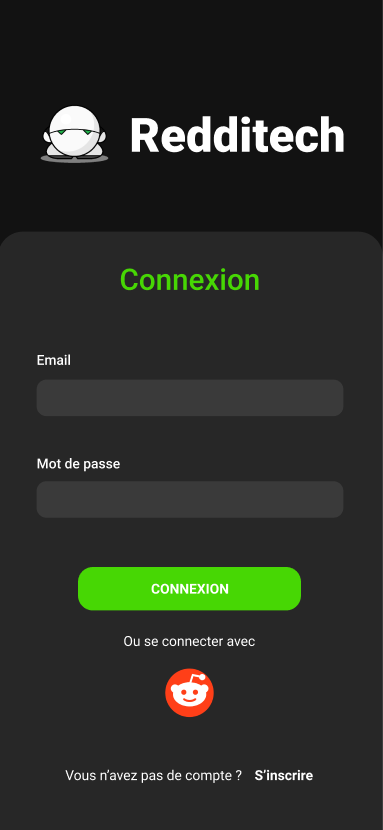
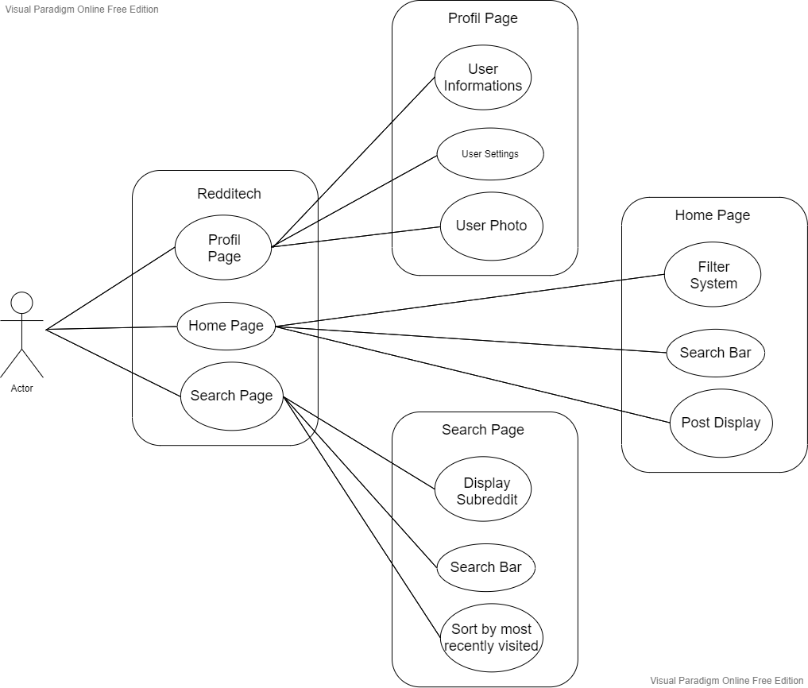
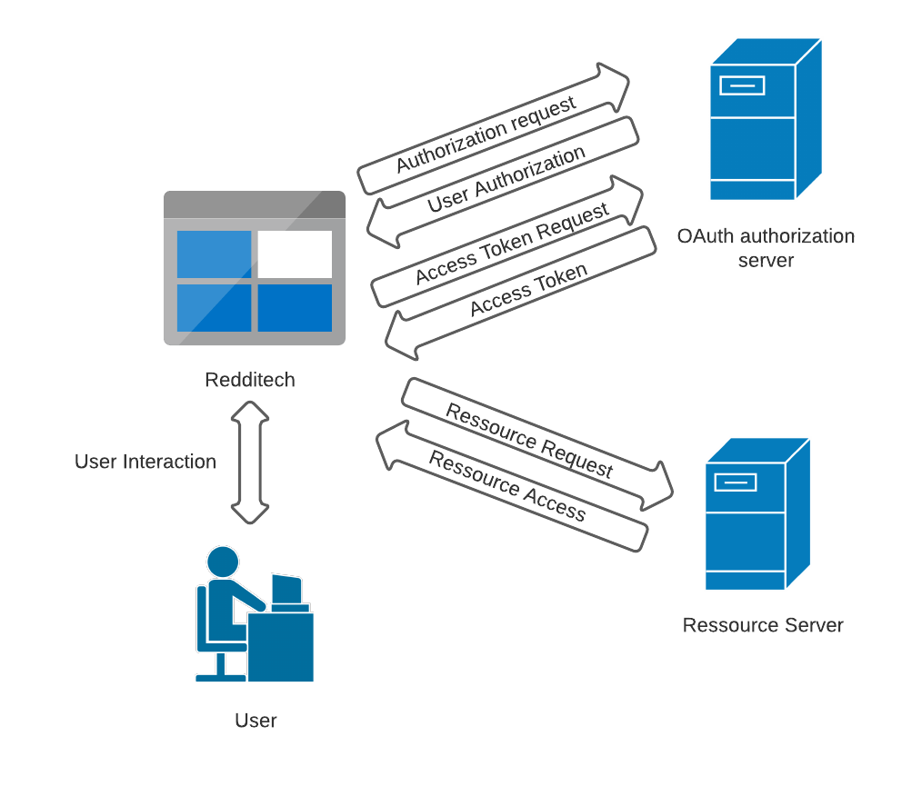

# Redditech Documentation

## Design

### Overall design

For this application we choose dark color mostly for the background, with white and green for text and other graphicals elements, the greenish color is taken from the eyes of marvin from "the Hitchhiker's Guide To The Galaxy" himself being the epitech mascot.

The application color code are as follow : 

* white : #FFFFFF

* very dark grey : #EDEDED

* grey : #272727

* green : #47D704

**Here is an exemple to ilustrate our design choice :**

- We decided to replace reddit logo with marvin head, both logo being similar in some way, this way it remind of Epitech whitout loosing reddit charm.

- The rest of the page is inspirated by the login page of reddit application, we believe that this design is more convenient for the user.

## UML Diagram

The UML diagram help us illustrate the interactions between the different element on the page, and how it benefit to the user.

As we can see in the "redditech" section, 3 different pages are provided for the user to display :

* The Profil Page, which has the following purpose (as seen in the "User informations" section) :

  * Display user informations.

  * allow editing of settings.

  * Display user profile picture, and allow to change it.

* The home page, which has the following purpose (as seen in the "Home page" section) :

  * Filter subreddit's by hot, top, new, etc..
  
  * Search bar to search subreddit's.

  * display post the user is subscribed to.

* The search page, which has the following purpose (as seen in the "Search page" section) :

  * Display the list of subscribed subreddit.

  * Search subreddit's among the subreddit's the user has subscribe to.

  * sort by most recently visited.

## Technical Architecture

### Oauth diagram

For secure authentification with reddit API it is mandatory to use the Oauth protocol.

In order to acess ressource from the reddit API we need to be granted with an access token, this access token cannot be granted directly since the Oauth protocol need to follow the following step :

 - **Authorization request** -> Ask reddit API for permission for Redditech to access user data, a browser page appear and allow the user to "grant" or "denied" the request.
 - **User Authorization** -> Authorization from reddit to user the API data, give authorization code.
 - **Access Token Request** -> The authorization code allow to ask for an authorization token.
 - **Access Token** -> A temporary access token is then provided for the Redditech app.

### File structure

The project contain the following files and folder :

 - **docs** -> Use to keep the images use in the README.md
 - **assets** -> Contain various icons use inside the application for the user interface.
 - **node_modules** -> Store external dependancies for nodejs.
 - **src** -> Folder for source code of the app.
 - **App.js** -> Specific source code file used to declare the pages and where to load their source code from.
 
## Quick Build & Start

Clone the repositorie : `git clone --depth 1 https://github.com/EpitechPromo2024/B-DEV-501-TLS-5-1-redditech-martin.legrand.git`

Get inside the folder : `cd B-DEV-501-TLS-5-1-redditech-martin.legrand`

Download npm & react native (If not already installed) `sudo apt install nodejs & npm install -g react-native-cli`

Start react CLI : `expo-cli start`

Open your browser and navigate to `127.0.0.1:19002`, then select tunnel.

Install **expo-go** on your phone using the Play Store (Or app store if you use and Iphone).

Scan the QR code provided on the webpage you previously opened.

The Redditech Application should open and you are done.
